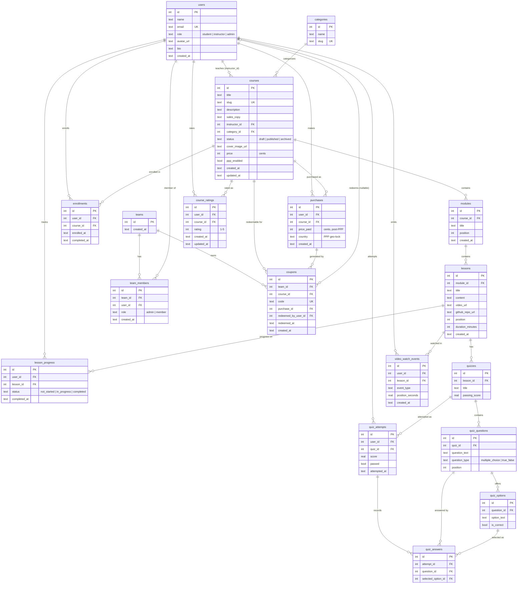

# Database Schema

ER diagram of the SQLite schema defined in [`app/db/schema.ts`](../app/db/schema.ts) (Drizzle ORM).

## Notes

- Enum values (`role`, `status`, `question_type`) are enforced at the TypeScript level only — stored as plain `text` with no DB CHECK constraints.
- Timestamps are ISO-8601 strings in `text` columns, defaulted app-side via Drizzle `$defaultFn`.
- Money (`price`, `price_paid`) is stored as integer cents; quiz scores are `real`.
- `coupons.redeemed_by_user_id` is the only nullable FK (unredeemed coupons).
- Junction-like tables (`enrollments`, `lesson_progress`, `team_members`) have no composite unique constraints — duplicate prevention happens in the service layer. `course_ratings` is the exception: a unique index on `(user_id, course_id)` enforces one rating per student per course at the DB level.